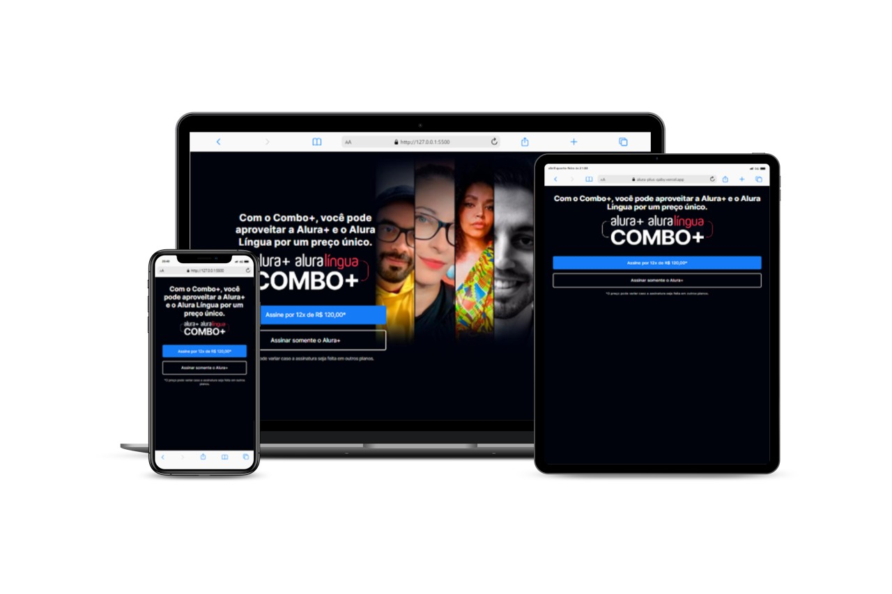

<h1 align="center">Landing Page do Alura Plus</h1>

## Sobre o projeto

Esse projeto foi desenvolvido durante as aulas praticas da <a href="https://www.alura.com.br/">Alura</a> de HTML e CSS, para consolidar os conteúdos. 
 
Esse site será usado para divulgação da Alura Plus, uma plataforma de streaming com os conteúdos educacionais da Alura.
 
Esse projeto está totalmente responsivo, se adaptando tanto para desktop quanto para mobile e tablet.

## 💻Tecnologias utilizadas

